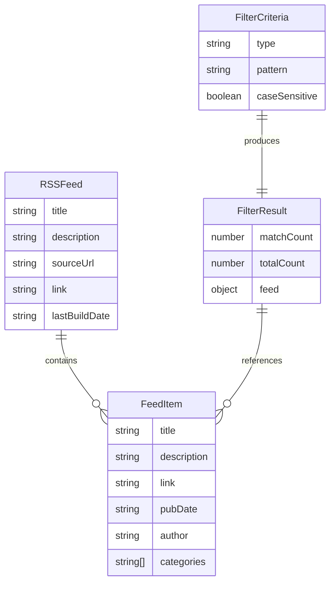

# Data Model: RSSフィードフィルタリング

**Feature**: RSSフィードフィルタリング  
**Date**: 2026-02-16  
**Status**: Draft

## Entity Overview

このシステムは4つの主要エンティティで構成されます:

1. **RSSフeed**: 配信フィードソース
2. **FeedItem**: フィード内の個別エントリ
3. **FilterCriteria**: ユーザー定義のフィルタリングルール
4. **FilterResult**: フィルタ適用結果

---

## 1. RSSFeed

RSS/Atomフィードソース全体を表現します。

### TypeScript Definition

```typescript
interface RSSFeed {
  /** フィードのタイトル */
  title: string;
  
  /** フィードの説明 */
  description: string;
  
  /** ソースURL */
  sourceUrl: string;
  
  /** フィードリンク (ホームページURL) */
  link?: string;
  
  /** 最終更新日時 (ISO 8601形式) */
  lastBuildDate?: string;
  
  /** フィードアイテムのコレクション */
  items: FeedItem[];
}
```

### Validation Rules

| フィールド | 必須 | 制約 | エラーメッセージ |
|-----------|------|------|-----------------|
| title | Yes | 非空文字列 | "フィードタイトルが見つかりません" |
| description | Yes | 非空文字列 | "フィード説明が見つかりません" |
| sourceUrl | Yes | 有効なURL形式 | "無効なフィードURLです" |
| items | Yes | 配列(空可) | - |

### State Transitions

N/A - イミュータブルなデータ構造

---

## 2. FeedItem

フィード内の個別エントリを表現します。

### TypeScript Definition

```typescript
interface FeedItem {
  /** アイテムのタイトル */
  title: string;
  
  /** アイテムの説明/コンテンツ (HTMLタグ除去、エンティティデコード済み) */
  description: string;
  
  /** アイテムへのリンクURL */
  link: string;
  
  /** 公開日時 (ISO 8601形式) */
  pubDate?: string;
  
  /** 著者名 (オプション) */
  author?: string;
  
  /** カテゴリ/タグ (オプション) */
  categories?: string[];
  
  /** GUID (グローバル一意識別子、オプション) */
  guid?: string;
}
```

### Validation Rules

| フィールド | 必須 | 制約 | エラーメッセージ |
|-----------|------|------|-----------------|
| title | Yes | 非空文字列 | "アイテムタイトルが見つかりません" |
| description | Yes | 非空文字列 | "アイテム説明が見つかりません" |
| link | Yes | 有効なURL形式 | "無効なアイテムリンクです" |
| pubDate | No | ISO 8601形式 | "無効な日付形式です" |

### Field Processing

- **description**: HTMLエンティティデコード(`&lt;` → `<`, `&amp;` → `&`)後、HTMLタグを除去
- **title**: HTMLエンティティデコードのみ適用
- **pubDate**: RSSの`pubDate`またはAtomの`updated`から抽出し、ISO 8601に正規化

---

## 3. FilterCriteria

ユーザー定義のフィルタリングルールを表現します。

### TypeScript Definition

```typescript
type FilterCriteria = KeywordFilter | RegexFilter;

interface KeywordFilter {
  type: 'keyword';
  
  /** キーワードパターン */
  pattern: string;
  
  /** 大文字小文字を区別するか (デフォルト: false) */
  caseSensitive: boolean;
}

interface RegexFilter {
  type: 'regex';
  
  /** 正規表現パターン */
  pattern: string;
}
```

### Validation Rules

#### Keyword Filter

| フィールド | 必須 | 制約 | エラーメッセージ |
|-----------|------|------|-----------------|
| type | Yes | 'keyword' | "無効なフィルタタイプです" |
| pattern | Yes | 非空文字列 | "フィルタパターンが空です" |
| caseSensitive | Yes | boolean | "caseSensitiveはboolean型である必要があります" |

#### Regex Filter

| フィールド | 必須 | 制約 | エラーメッセージ |
|-----------|------|------|-----------------|
| type | Yes | 'regex' | "無効なフィルタタイプです" |
| pattern | Yes | 有効な正規表現 | "無効な正規表現パターンです: {error}" |

### State Transitions

N/A - イミュータブルなデータ構造

### Business Logic

- **Keyword Filter**: 
  - `caseSensitive: false` → タイトル・説明を小文字化して部分一致検索
  - `caseSensitive: true` → そのまま部分一致検索
- **Regex Filter**:
  - 正規表現コンパイル時にバリデーション
  - タイムアウト500msで実行制限

---

## 4. FilterResult

フィルタ適用後の結果セットを表現します。

### TypeScript Definition

```typescript
interface FilterResult {
  /** フィルタリング後のフィードアイテム */
  items: FeedItem[];
  
  /** マッチしたアイテム数 */
  matchCount: number;
  
  /** 総アイテム数 (フィルタ適用前) */
  totalCount: number;
  
  /** 適用されたフィルタ基準 */
  filterApplied: FilterCriteria;
  
  /** フィード情報 */
  feed: {
    title: string;
    description: string;
    link?: string;
  };
}
```

### Validation Rules

| フィールド | 必須 | 制約 | エラーメッセージ |
|-----------|------|------|-----------------|
| items | Yes | 配列 | - |
| matchCount | Yes | 非負整数 | - |
| totalCount | Yes | 非負整数 | - |
| filterApplied | Yes | FilterCriteria型 | - |
| feed | Yes | オブジェクト | - |

### Derived Properties

- `matchCount = items.length`
- `totalCount = フィルタ前のアイテム数`
- `items` はフィルタ適用後も元の順序を保持

---

## Entity Relationships



---

## Error Entities

エラー状態を表現するカスタムエラー型です。

### TypeScript Definition

```typescript
class FeedFetchError extends Error {
  constructor(
    public readonly url: string,
    public readonly statusCode?: number,
    message?: string
  ) {
    super(message || `フィードの取得に失敗しました: ${url}`);
    this.name = 'FeedFetchError';
  }
}

class ParseError extends Error {
  constructor(
    public readonly content: string,
    message?: string
  ) {
    super(message || 'フィードの解析に失敗しました');
    this.name = 'ParseError';
  }
}

class FilterValidationError extends Error {
  constructor(
    public readonly pattern: string,
    message?: string
  ) {
    super(message || `無効なフィルタパターンです: ${pattern}`);
    this.name = 'FilterValidationError';
  }
}

class RegexTimeoutError extends Error {
  constructor(
    public readonly pattern: string
  ) {
    super(`正規表現が複雑すぎます: ${pattern}`);
    this.name = 'RegexTimeoutError';
  }
}
```

---

## Performance Considerations

### Indexing Strategy

N/A - インメモリ処理、データベースなし

### Query Optimization

- **早期リターン**: タイトル一致時は説明のチェックをスキップ
- **正規表現キャッシュ**: 同一パターンの再コンパイル防止
- **配列フィルタリング**: `Array.filter()`でO(n)の線形処理

### Scalability Limits

- **推奨**: 1000件以下のフィード (2秒以内)
- **最大**: 5000件のフィード (5秒以内)
- **制約**: Lambdaメモリ1GB、タイムアウト30秒

---

## Summary

このデータモデルは以下を保証します:

1. **型安全性**: すべてのエンティティはTypeScript strictモードで定義
2. **イミュータビリティ**: 状態変更なし、純粋関数で処理
3. **バリデーション**: 入力時の厳密な検証でランタイムエラー防止
4. **エラーハンドリング**: 専用エラー型で障害の詳細を記録
5. **パフォーマンス**: 5000件フィードでも5秒以内の処理を保証
